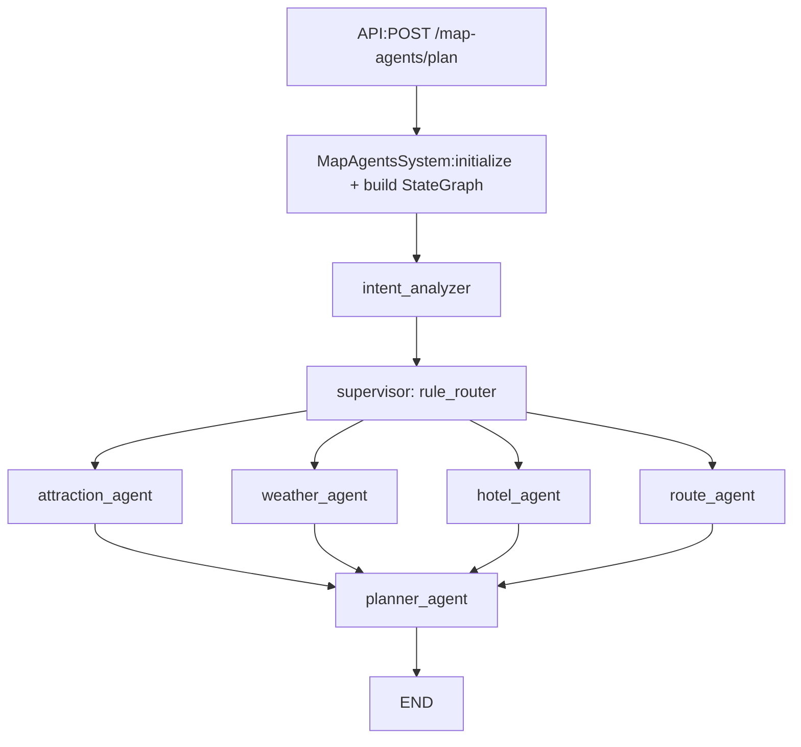

## 架构学习指南（面向裁剪）

你现在看到的系统是一个「LangGraph 工作流 + Supervisor-Worker 多智能体 + 强类型 Planner 汇总」的组合。为了重新掌控复杂度，建议你只盯住“数据流 + 状态契约 + 必须不变量”，并把所有“变化点/矛盾点”标出来。

---

### 1. 数据流总览

核心闭环是：`intent_analyzer` 只做一次意图抽取 -> `supervisor` 只做规则路由 -> `workers` 填充 `attractions/weather_info/hotels/routes` -> `planner_agent` 把这些字段汇总成 `TripPlan`。

---

### 2. 状态（AgentState）契约：哪些字段会被写入/合并

相关类型定义在 [`backend/app/agents/schemas/state.py`](backend/app/agents/schemas/state.py)。

在 LangGraph 中，这些字段带有合并策略（`operator.add` / `merge_dicts`）：

- `messages: Annotated[List[BaseMessage], operator.add]`
- `attractions: Annotated[list, operator.add]`
- `weather_info: Annotated[list, operator.add]`
- `hotels: Annotated[list, operator.add]`
- `routes: Annotated[list, operator.add]`
- `agent_call_count: Annotated[dict, merge_dicts]`
- `agent_results: Annotated[dict, merge_dicts]`
- `errors: Annotated[List[dict], merge_errors]`

其它字段（一般由单个节点写入）：

- `trip_intent: dict`：由 `IntentAnalyzer` 写入
- `final_plan: dict`：由 `Planner` 写入
- `next: Union[str, List[str]]`：由 `supervisor`/路由逻辑写入

**学习要点**：你不需要读完整的 prompt 文案，先把“每个节点负责写哪些 state 字段”读清楚即可。

---

### 3. 节点/组件逐个对应（你需要掌握的输入输出）

#### 3.1 `intent_analyzer`

文件：[`backend/app/agents/intent_analyzer.py`](backend/app/agents/intent_analyzer.py)

职责：

- 读取 `state["messages"]` + 表单字段（`city/travel_days/start_date/end_date/transportation/accommodation/preferences/free_text_input`）
- 一次性调用 LLM，通过 `with_structured_output(TripIntent)` 输出结构化 `trip_intent`

输出（写入 state）：

- `trip_intent: dict`
- `next: first_wave 或 "planner_agent"`

关键点：后续节点不应再次“重新理解用户”，而是只读 `trip_intent`。

#### 3.2 `supervisor`

文件：[`backend/app/agents/supervisor.py`](backend/app/agents/supervisor.py) + [`backend/app/agents/rule_router.py`](backend/app/agents/rule_router.py)

职责：

- `Supervisor` 本身是包装器
- 实际决策完全由 `smart_router/fault_check_router` 进行规则判断（纯逻辑，无需 LLM）

输出（写入 state）：

- `next: "attraction_agent/weather_agent/hotel_agent/route_agent/planner_agent"`（支持 list 并发）

#### 3.3 `workers`（attraction/weather/hotel/route）

文件：[`backend/app/agents/workers.py`](backend/app/agents/workers.py)

职责：

- 动态为每个 worker 创建一个 LangChain `create_react_agent(model=self.llm, tools=tools)`
- `BaseWorker.execute()` 做：
  - 构建输入 messages（含 `【当前任务上下文】`）
  - 调用 agent + 工具
  - 从 `response` 中解析出 JSON 并做校验/清洗（可选 validator）
  - 把结果写回 `state` 对应的 output_key 列表：`attractions/weather_info/hotels/routes`

关键点：

- `web_search` 是主要“成本放大器”之一（mcp_tools 之外的网络检索工具）
- `route_agent` 的输出还会经过幻觉过滤（当前逻辑只允许 origin/destination 出现在 attractions 名称集合中）

#### 3.4 `planner_agent`

文件：[`backend/app/agents/workers.py`](backend/app/agents/workers.py) 中的 `class Planner`

职责：

- 使用 `self.structured_llm = llm.with_structured_output(TripPlan)`
- 从 state 读取 `attractions/hotels/routes/weather_info`，并做字段清洗（`_extract_planner_fields`）
- 把结构化数据连同 `trip_intent` 约束拼成一个 `HumanMessage`，让 Planner 输出强类型 `TripPlan`

输出（写入 state）：

- `final_plan: dict`（最终 `TripPlan.model_dump()`）
- `next: "end"`

---

### 4. 必须满足的不变量（用于裁剪时避免“改了但更糟”）

你在任何重构/裁剪时，都建议把下面几条当作“不变量”：

1. **意图契约不变量**：`trip_intent` 必须由 `IntentAnalyzer` 产生且在后续被稳定读取（workers/planner 只能依赖结构化意图字段，不应再从消息历史二次推断）。
2. **状态合并不变量**：`attractions/weather_info/hotels/routes/messages` 的写入必须仍然依赖 LangGraph 的合并策略（否则并发执行会导致丢字段）。
3. **强类型不变量**：`Planner` 的输出必须始终能被 `TripPlan` 校验；即便模型生成失败，也要走兜底 `TripPlan(...)` 返回最小可用结构。
4. **工具输入一致性不变量**：任何 worker 使用的工具输入格式（例如 direction 工具的 `origin/destination="经度,纬度"`）必须与 prompt/上下文约束完全一致，否则会引发重试与输出被过滤（“看起来复杂但质量不升”通常来自这一类不一致）。
5. **grounding 不变量（质量相关）**：如果某类内容（如 meals/避雷/交通细节）没有检索证据支持，就必须在生成端施加硬约束（要么留空、要么只给通用安全建议），否则会明显胡编。

---

### 5. 高优先级矛盾点（本次重点核对）

下面 4 点是你当前“代码越改越复杂、效果提升不大”的高发原因。每一条都包含“如果不修会怎样”的推断。

1. **API 调用方法不一致**
   - 位置：
     - [`backend/app/api/routes/map_agents_router.py`](backend/app/api/routes/map_agents_router.py) 调用 `system.plan_trip_async(request)`
     - [`backend/app/agents/main.py`](backend/app/agents/main.py) 中当前可见的方法是 `plan_trip`（未见 `plan_trip_async`）
   - 若不修会怎样：
     - 运行时可能报错或走兜底路径，导致你观察到的“效果提升不稳定/偶发变差”，并且你会误以为是模型质量问题。

2. **route prompt 约束 vs route 工具输入不一致**
   - 位置：
     - [`backend/app/agents/prompts/agents.py`](backend/app/agents/prompts/agents.py) 的 `ROUTE` 提示要求 `origin/destination` 必须是 attractions 数据中的“景点名称”
     - [`backend/app/agents/tools` + `backend/app/services/mcp_tools.py`](backend/app/services/mcp_tools.py) 的 direction 工具输入要求 `origin/destination` 是 `经度,纬度` 数字坐标（见 `DirectionToolInput`）
     - `workers.py` 的 `build_route_context()` 也明确提供“坐标”用于调用路线工具
   - 若不修会怎样：
     - route_agent 可能输出的路线细节要么失败要么被过滤（幻觉过滤只允许 origin/destination 是 attractions 名称），从而 Planner 得不到可靠路线证据，只能叙事补全。

3. **Planner routes 清洗字段白名单问题**
   - 位置：[`backend/app/agents/workers.py`](backend/app/agents/workers.py) 的 `_extract_planner_fields()`
   - 现象推断：
     - `_extract_planner_fields` 用同一套 `ESSENTIAL_KEYS` 给 attractions/hotels/routes 做过滤，但 routes 数据结构（`origin/destination/transportation/duration/route_detail`）与该 key 集合不匹配，导致 `routes_context` 很可能被清空。
   - 若不修会怎样：
     - Planner 失去路线输入证据，交通相关描述更容易“编故事”，同时也会降低你对“效果提升”的体感稳定性。

4. **meals/避雷 grounding 缺口**
   - 位置：
     - system 当前没有专门的餐饮检索 worker（只有 attraction/weather/hotel/route）
     - `frontend` 和 `TripPlan` schema 支持 `days[].meals`
     - `backend/app/agents/prompts/agents.py` 的 `PLANNER` 文案示例倾向输出具体餐厅/避雷细节
   - 若不修会怎样：
     - meals/避雷内容会更多依赖模型“想象”，导致少胡编目标难以达成；并且预算中的 meals 也会更难校验。

---

### 6. 建议的学习顺序（让你快速“能改得动”）

1. 先读入口链路：[`backend/app/agents/main.py`](backend/app/agents/main.py) + [`backend/app/api/routes/map_agents_router.py`](backend/app/api/routes/map_agents_router.py)
2. 再读状态契约：[`backend/app/agents/schemas/state.py`](backend/app/agents/schemas/state.py)
3. 最后读每个节点如何写字段：`intent_analyzer.py` / `rule_router.py` / `workers.py`（尤其是 `BaseWorker.execute()` 和 `Planner.generate()`）

